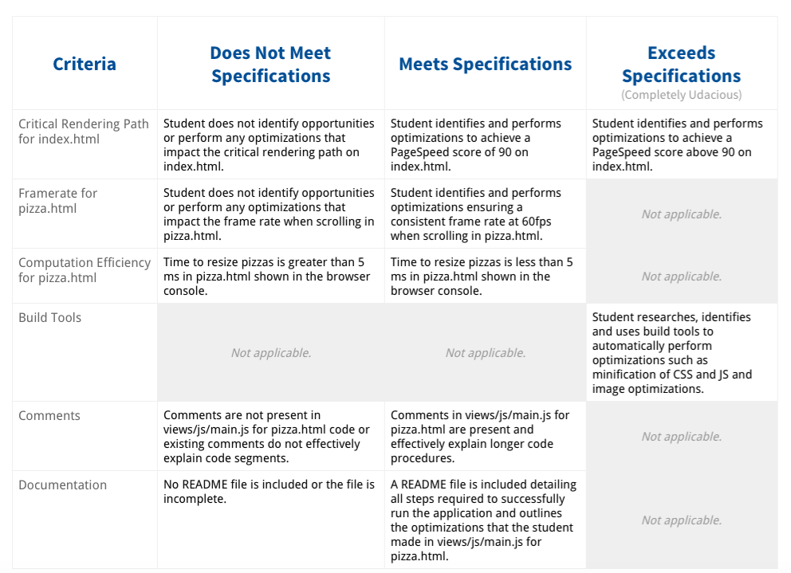

### How will I complete this project?

* Download the [required project assets](https://github.com/udacity/frontend-nanodegree-mobile-portfolio).

* Use Chrome Developer Tools to review the current state of various pages within the application and identify areas for improvement.

* Review the code powering the website and identify areas where you believe modifications are warranted.

* Iteratively make changes and test those changes using the tools available to you to determine if they are a performance gain or loss.

### Rubric

All criteria must "meet specifications".

